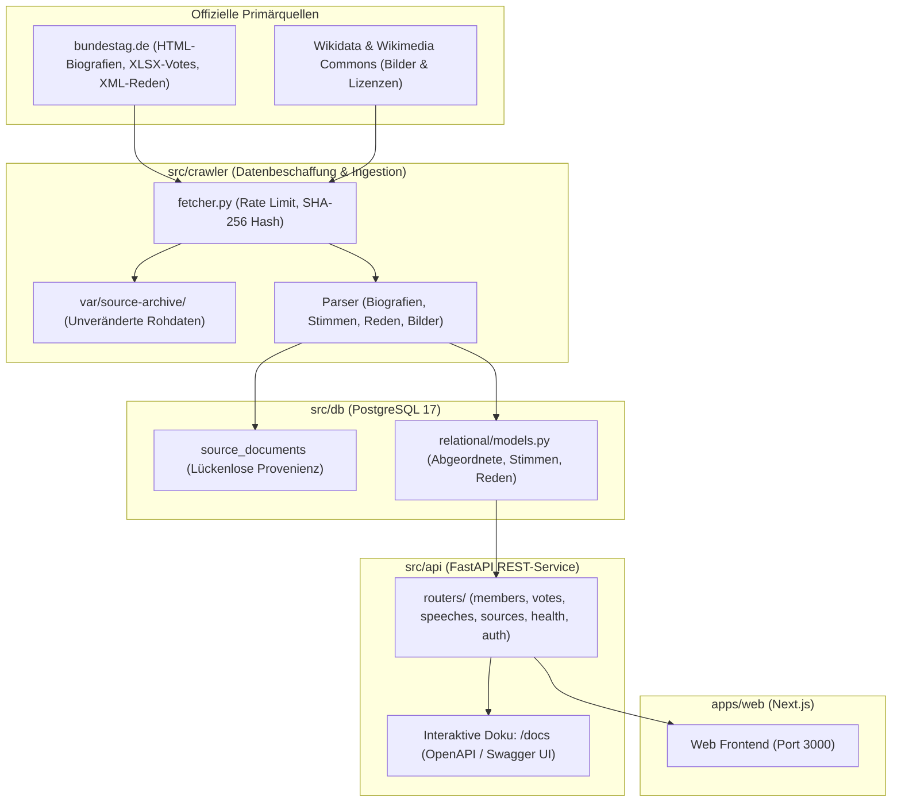

# Politiklar Backend

Das Backend von Politiklar ist das zentrale Datenbeschaffungs- und Bereitstellungssystem der Plattform. Es ist in Python (3.11+) implementiert und kombiniert datenschutzkonformes Primärquellen-Crawling mit strenger Quellenprovenienz, PostgreSQL-Datenhaltung und einer modernen FastAPI-REST-Schnittstelle.

---

## 🏛️ Architektur-Übersicht



---

## 📂 Modulstruktur

```text
apps/backend/
├── migrations/             # Alembic-Datenbankmigrationen (Schema-Versionierung)
├── src/
│   ├── api/                # FastAPI REST-API (für Web-Frontend & Clients)
│   │   ├── main.py         # App-Factory, CORS, Route-Registrierung
│   │   ├── dependencies.py # Dependency Injection (DB-Session, Settings)
│   │   ├── routers/        # Modulare Endpunkte (members, votes, speeches, sources, etc.)
│   │   └── schemas/        # Pydantic-Schemas (Request/Response DTOs & Validierung)
│   │
│   ├── core/               # Querschnittliche Einstellungen & Basisfunktionen
│   │   └── settings.py     # Pydantic Settings (.env, Crawler-Parameter, URLs)
│   │
│   ├── crawler/            # Primärquellen-Abruf, Discovery & Parser
│   │   ├── fetcher.py      # HTTP-Client mit Rate-Limit, Retries & SHA-256
│   │   ├── bundestag_import.py  # Batch-Import & inkrementeller Refresh
│   │   ├── bundestag_biography.py # Parser für MdB-Biografien (HTML)
│   │   ├── named_votes.py  # Parser für namentliche Abstimmungen (XLSX)
│   │   ├── plenary_speeches.py # Parser für Plenarprotokolle (XML)
│   │   ├── member_images.py # Bild- & Lizenzabgleich (Wikidata / Commons API)
│   │   └── member_source_identifiers.py # Evidenzbasierte ID-Zuordnungen
│   │
│   └── db/                 # Persistenzschicht
│       ├── relational/     # SQLAlchemy 2.0 ORM & Session-Management
│       │   ├── models.py   # DB-Tabellen (SourceDocument, Member, NamedVote, etc.)
│       │   └── session.py  # Engine & DB-Session-Factory
│       └── vector/         # Reserviert für zukünftige Embeddings (pgvector / RAG)
│
├── tests/                  # Pytest-Testsuite (Parser, Modelle, API-Tests)
├── alembic.ini             # Alembic-Konfiguration
├── Dockerfile              # Container-Build für API und Crawler
└── pyproject.toml          # Paket- und Abhängigkeitsdefinition
```

---

## 📡 Die API & Automatische Dokumentation

Die API stellt alle aufbereiteten Daten über REST-Endpunkte zur Verfügung.

### Automatische OpenAPI- / Swagger-Dokumentation
Sobald das Backend läuft, generiert FastAPI automatisch eine interaktive Dokumentation direkt aus den Python-Typen und Pydantic-Schemas:

* **Swagger UI (interaktiv):** [http://localhost:8000/docs](http://localhost:8000/docs)
  * Hier können alle Endpunkte direkt im Browser getestet werden („Try it out“).
* **ReDoc (Übersichtliche Dokumentation):** [http://localhost:8000/redoc](http://localhost:8000/redoc)
* **OpenAPI-JSON (Maschinenlesbar):** [http://localhost:8000/openapi.json](http://localhost:8000/openapi.json)

### Haupt-Endpunkte

| Route | Beschreibung |
| :--- | :--- |
| `GET /health` | Healthcheck (Prüft Service-Uptime und Datenbankverbindung) |
| `GET /members` | Liste aller Abgeordneten mit Filtern nach Fraktion, Wahlkreis etc. |
| `GET /members/{id}` | Detailprofil eines Abgeordneten inklusive Mandate, Büros und Rollen |
| `GET /votes` | Liste aller namentlichen Abstimmungen der Wahlperiode |
| `GET /votes/{id}` | Detailergebnis einer Abstimmung inklusive Einzelergebnisse |
| `GET /speeches` | Plenarprotokolle und erfasste Reden |
| `GET /sources` | Belege und Quellennachweise (URLs, SHA-256 Hashes) zur Faktenprüfung |

---

## 🕷️ Der Crawler: Was wird wo gecrawlt?

Gemäß den Projektregeln gilt: **Keine Fakten ohne Primärquelle und keine Namensraterei!**

1. **Abgeordnetenbiografien (HTML):**
   * Quelle: `bundestag.de/abgeordnete/biografien/...`
   * Parser: `crawler/bundestag_biography.py`
   * Daten: MdB-ID, Name, Fraktion, Wahlergebnis, Büros, Ausschussmitgliedschaften.
2. **Namentliche Abstimmungen (XLSX):**
   * Quelle: `bundestag.de/parlament/plenum/abstimmung/liste` (offizielle Excel-Dateien).
   * Parser: `crawler/named_votes.py`
   * Daten: Datum, Thema, Einzelstimmen (`yes`, `no`, `abstained`, `invalid`, `not_voted`).
3. **Plenarreden (XML):**
   * Quelle: Bundestags-Plenarprotokoll-XMLs.
   * Parser: `crawler/plenary_speeches.py`
   * Daten: Sitzungsnummer, Rede-ID, Sprecher-ID, Volltext der Rede.
4. **Abgeordnetenbilder & Lizenzen (Wikidata / Wikimedia Commons API):**
   * Quelle: Wikidata Entity Lookup & Wikimedia Commons API.
   * Parser: `crawler/member_images.py`
   * Logik: Strikte Verifikation der Wikidata-MdB-ID (`P1186`/`P1713`). Nur freie Lizenzen (CC-BY, CC0, PD) werden freigegeben.
5. **Quellenarchivierung:**
   * Jeder Abruf wird unverändert mit SHA-256-Prüfsumme in `var/source-archive/<prefix>/<sha256>` archiviert und in der Tabelle `source_documents` protokolliert.

---

## 🛠️ Wichtige Befehle für Entwickler

Alle zentralen Befehle werden über das Haupt-[Makefile](../../Makefile) im Projekt-Root gesteuert:

### Entwicklung & Server starten
```bash
# Gesamte Umgebung (DB, API, Web) per Docker starten:
make up

# Nur PostgreSQL starten:
make db

# Lokalen FastAPI-Dev-Server mit Hot-Reloading starten (erfordert venv):
make api-dev
```

### Crawler & Datenimport ausführen
```bash
# Inkrementelles Update (lädt nur neue Dokumente & fehlende Bilder nach):
make bundestag-refresh

# Vollimport aller Quellen der 21. Wahlperiode:
make bundestag-import

# Nur Abgeordnete und Bilder aktualisieren:
make bundestag-refresh FAMILY=members

# Einzelne Biografie importieren:
make member-import URL=https://www.bundestag.de/abgeordnete/biografien/A/abdi_sanae-1043330
```

### Tests & Datenbankmigrationen
```bash
# Backend-Testsuite ausführen:
make test
# oder direkt in der virtuellen Umgebung:
apps/backend/.venv/bin/pytest apps/backend/tests

# Datenbankmigrationen anwenden:
make db-migrate

# Letzte Migration zurückrollen:
make db-migrate-down
```

---

## 📖 Weiterführende Dokumentation

Ausführliche Architektur- und Schemadetails findest du im zentralen Dokumentationsordner:
* [Datenbankschema und Tabellenbeziehungen](../../docs/database-schema.md)
* [Detaillierte Crawler-Dokumentation](../../docs/crawler-and-import.md)
* [Gesamtarchitektur & Richtlinien](../../docs/architecture.md)
