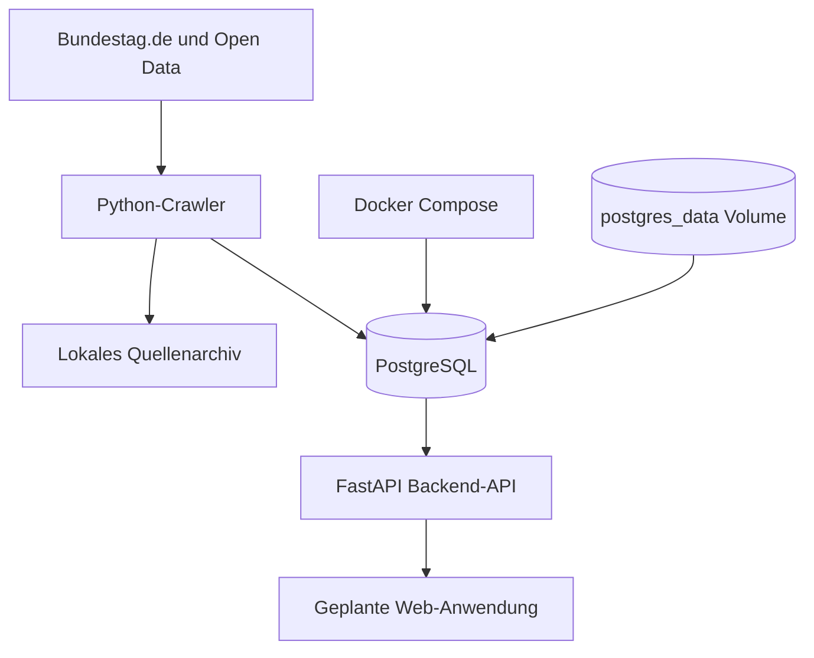

# Aktuelle Architektur

## Implementiert

- PostgreSQL 17 in Docker Compose
- Persistentes `postgres_data`-Volume
- Python-Crawler mit HTTP-Provenienz und Quellenarchiv
- Alembic-Migrationen
- Importer fuer einzelne Bundestag-Biografien, namentliche Abstimmungen und Plenarprotokolle
- FastAPI Backend-API (`apps/backend/src/api/`) mit OpenAPI-Dokumentation (`/docs`), Healthchecks, Quellenprovenienz, Abgeordneten-, Abstimmungs- und Reden-Endpunkten
- RAG- und Vektordaten-Grundgerüst (pgvector HNSW-Index, Gemini-Anbindung, LangChain Chunker und Endpunkte auf Branch `feature/rag-gemini-pgvector`, siehe [rag-architecture.md](rag-architecture.md))

## Noch geplant

- Vollstaendige Mitgliederdiscovery
- Drucksachenimport mit konfiguriertem DIP-API-Key
- Verifizierte Zuordnung von Abstimmungs- und Redezeilen zur MDB-ID
- Ingestion-Job zur Einbettung historischer Reden und Dokumente
- Web-Anwendung und MCP-Server

Zurueck zur [Dokumentationsuebersicht](README.md).