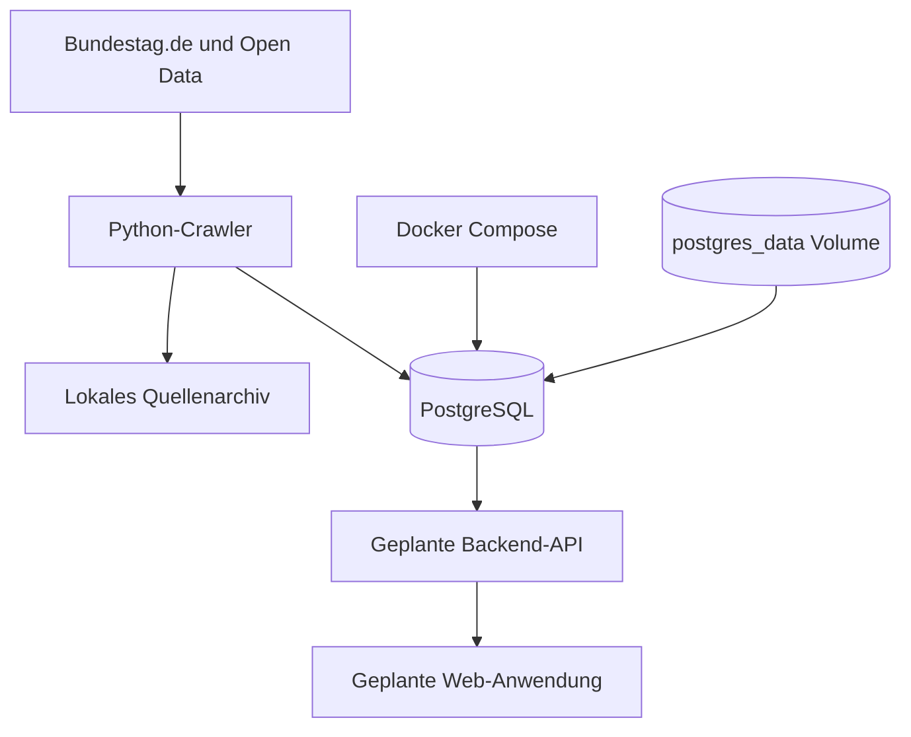

# Aktuelle Architektur

## Implementiert

- PostgreSQL 17 in Docker Compose
- Persistentes `postgres_data`-Volume
- Python-Crawler mit HTTP-Provenienz und Quellenarchiv
- Alembic-Migrationen
- Importer fuer einzelne Bundestag-Biografien, namentliche Abstimmungen und Plenarprotokolle

## Noch geplant

- Vollstaendige Mitgliederdiscovery
- Drucksachenimport mit konfiguriertem DIP-API-Key
- Verifizierte Zuordnung von Abstimmungs- und Redezeilen zur MDB-ID
- Backend-API, Web-Anwendung, RAG und MCP-Server

Zurueck zur [Dokumentationsuebersicht](README.md).