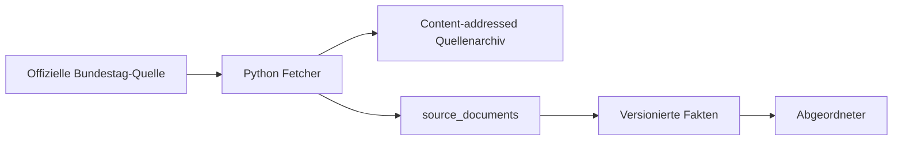

# Datenbankschema

PostgreSQL speichert fachliche Fakten getrennt von ihren Quellenbelegen. Das aktuelle Schema wird durch Alembic-Migrationen verwaltet. Jede neue Migration muss diese Seite und die betroffenen Mermaid-Diagramme in derselben Aenderung aktualisieren.

## Migrationen

```bash
make db-migrate
make db-migrate-down
```

Die Migrationen befinden sich unter [apps/backend/migrations/versions](../apps/backend/migrations/versions). Eine Rueckrollpruefung erfolgt immer nur fuer die zuletzt angewendete Revision.

## Quellenfluss



`source_documents` identifiziert einen unveraenderten Quelleninhalt ueber `resolved_url` und `content_sha256`. Importierte Fakten tragen einen Fremdschluessel auf das konkrete Quelldokument. Der Archivpfad verweist auf die unveraenderte lokale Kopie der Antwort.

## Abgeordnetendaten

```mermaid
erDiagram
    SOURCE_DOCUMENTS ||--o{ MEMBER_TERMS : belegt
    SOURCE_DOCUMENTS ||--o{ MEMBER_PROFILE_SNAPSHOTS : belegt
    SOURCE_DOCUMENTS ||--o{ MEMBER_OFFICES : belegt
    SOURCE_DOCUMENTS ||--o{ MEMBER_CONTACT_POINTS : belegt
    SOURCE_DOCUMENTS ||--o{ MEMBER_MANDATES : belegt
    SOURCE_DOCUMENTS ||--o{ MEMBER_EXTERNAL_PROFILES : belegt
    SOURCE_DOCUMENTS ||--o{ MEMBER_AFFILIATIONS : belegt
    SOURCE_DOCUMENTS ||--o{ MEMBER_EXTERNAL_IDENTIFIERS : belegt
    SOURCE_DOCUMENTS ||--o{ MEMBER_SOURCE_IDENTIFIERS : belegt
    SOURCE_DOCUMENTS ||--o{ MEMBER_SOURCE_IDENTIFIER_EVIDENCE : belegt
    MEMBER_SOURCE_IDENTIFIERS ||--o{ MEMBER_SOURCE_IDENTIFIER_EVIDENCE : hat
    SOURCE_DOCUMENTS ||--o{ MEMBER_IMAGE_CANDIDATES : belegt
    BUNDESTAG_MEMBERS ||--o{ MEMBER_TERMS : hat
    BUNDESTAG_MEMBERS ||--o{ MEMBER_PROFILE_SNAPSHOTS : hat
    BUNDESTAG_MEMBERS ||--o{ MEMBER_OFFICES : hat
    BUNDESTAG_MEMBERS ||--o{ MEMBER_CONTACT_POINTS : hat
    BUNDESTAG_MEMBERS ||--o{ MEMBER_MANDATES : hat
    BUNDESTAG_MEMBERS ||--o{ MEMBER_EXTERNAL_PROFILES : hat
    BUNDESTAG_MEMBERS ||--o{ MEMBER_AFFILIATIONS : hat
    BUNDESTAG_MEMBERS ||--o{ MEMBER_EXTERNAL_IDENTIFIERS : hat
    BUNDESTAG_MEMBERS ||--o{ MEMBER_SOURCE_IDENTIFIERS : hat
    BUNDESTAG_MEMBERS ||--o{ MEMBER_IMAGE_CANDIDATES : hat

    SOURCE_DOCUMENTS {
        uuid id PK
        string publisher
        string resolved_url
        string content_sha256
        datetime retrieved_at
        string snapshot_location
    }
    BUNDESTAG_MEMBERS {
        uuid id PK
        int mdb_id UK
    }
    MEMBER_PROFILE_SNAPSHOTS {
        uuid member_id FK
        string first_name
        string last_name
        string parliamentary_group
        boolean is_current
    }
    MEMBER_MANDATES {
        uuid member_id FK
        string mandate_type
        int constituency_number
        date start_date
    }
    MEMBER_IMAGE_CANDIDATES {
        uuid member_id FK
        string license_name
        boolean license_approved
        string status
    }
    MEMBER_SOURCE_IDENTIFIERS {
        uuid member_id FK
        string source_system
        string source_identifier UK
        string verification_status
        datetime verified_at
    }
    MEMBER_SOURCE_IDENTIFIER_EVIDENCE {
        uuid member_source_identifier_id FK
        uuid source_document_id FK
        string evidence_role
    }
```



`bundestag_members.mdb_id` ist eindeutig. Profil-, Buero-, Kontakt-, Mandats-, Profil-Link- und Rollenwerte sind ueber fachliche Content-Hashes idempotent. Externe Identifikatoren sind je `(namespace, identifier)` eindeutig.

Portraits werden nur als Wikimedia-Commons-Kandidaten mit Autor, Attribution und Lizenzmetadaten modelliert. Der Status `approved` verlangt `license_approved = true`; ein partieller Unique-Index erlaubt hoechstens ein freigegebenes Bild pro Abgeordnetem.

`member_source_identifiers` ordnet eine externe amtliche Kennung verbindlich einer MDB-ID zu. Fuer Plenarprotokolle lautet das Quellsystem `bundestag_plenary_speaker`. Jede verifizierte Zuordnung hat zwei Belege in `member_source_identifier_evidence`: die Bundestag-Biografie fuer die MDB-ID und das Plenarprotokoll fuer die Sprecher-ID. Nur ein Review mit beiden Belegen setzt den Status auf `verified`.

## Parlamentsereignisse

```mermaid
erDiagram
    SOURCE_DOCUMENTS ||--o{ NAMED_VOTES : belegt
    SOURCE_DOCUMENTS ||--o{ NAMED_VOTE_ROWS : belegt
    SOURCE_DOCUMENTS ||--o{ PARLIAMENTARY_SPEECHES : belegt
    NAMED_VOTES ||--o{ NAMED_VOTE_ROWS : enthaelt
    BUNDESTAG_MEMBERS o|--o{ NAMED_VOTE_ROWS : optional
    BUNDESTAG_MEMBERS o|--o{ PARLIAMENTARY_SPEECHES : optional

    NAMED_VOTES {
        uuid id PK
        int electoral_term
        int sitting_number
        int vote_number
        string content_sha256
    }
    NAMED_VOTE_ROWS {
        uuid named_vote_id FK
        uuid member_id FK nullable
        string raw_outcome
        string outcome
        string display_name
    }
    PARLIAMENTARY_SPEECHES {
        uuid protocol_source_document_id FK
        uuid member_id FK nullable
        string speech_locator
        string speaker_source_id
        string text
    }
```

`named_vote_rows.outcome` ist auf `yes`, `no`, `abstained`, `invalid`, `not_voted` und `unknown` beschraenkt. Stimmen- und Redereihen werden vollstaendig mit ihren amtlichen Namen beziehungsweise Sprecher-IDs gespeichert, aber nur bei verifizierter ID-Zuordnung mit einem Abgeordneten verknuepft.

## Tabellenuebersicht

| Tabelle | Zweck |
| --- | --- |
| `source_documents` | Unveraenderliche Abrufprovenienz und Archivverweis |
| `bundestag_members` | Abgeordneter mit eindeutiger MDB-ID |
| `member_terms` | Wahlperiodenmitgliedschaft |
| `member_profile_snapshots` | Historische Stammdatenbeobachtungen |
| `member_offices` | Bundestags- und Wahlkreisbueros |
| `member_contact_points` | Amtliche Kontaktpunkte, etwa Kontaktformulare |
| `member_mandates` | Wahlkreis- und Mandatsbeobachtungen |
| `member_external_profiles` | Auf der Biografie verlinkte externe Profile |
| `member_affiliations` | Ausschuesse, Aemter und weitere Rollen |
| `member_external_identifiers` | Verifizierte IDs anderer Quellsysteme |
| `member_source_identifiers` | Gepruefte Zuordnung einer Quellsystem-ID zu einer MDB-ID |
| `member_source_identifier_evidence` | Amtliche Biografie- und Protokollbelege fuer eine Zuordnung |
| `member_image_candidates` | Lizenz- und Review-Workflow fuer Commons-Portraits |
| `named_votes` | Amtliche namentliche Abstimmungen |
| `named_vote_rows` | Amtliche Ergebniszeilen je Abstimmung |
| `parliamentary_speeches` | Amtliche Reden aus Plenarprotokollen |

Zurueck zur [Dokumentationsuebersicht](README.md).