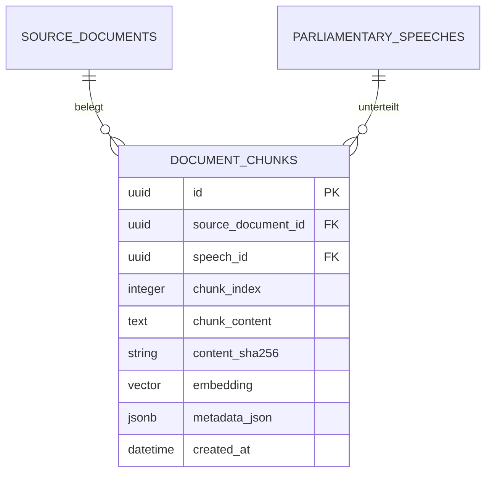

# RAG- & Vektor-Architektur (Politiklar)

Diese Dokumentation beschreibt die Vorbereitung und Architektur des RAG-Systems (Retrieval-Augmented Generation) mit PostgreSQL `pgvector`, Google Gemini API und LangChain auf dem Branch `feature/rag-gemini-pgvector`.

---

## 1. Überblick & Status

| Komponente | Technologie / Modell | Zweck |
| --- | --- | --- |
| **Vektordatenbank** | PostgreSQL 17 + `pgvector` (Extension) | Vektorspeicherung mit HNSW-Index (`vector_cosine_ops`) |
| **Embedding-Modell** | Google Gemini `models/text-embedding-004` (768 Dimensionen) | Vektorisierung von Textabschnitten und Suchanfragen |
| **LLM / Chat** | Google Gemini `gemini-2.5-flash` | Evidenzbasierte, parteipolitisch neutrale Antwortgenerierung |
| **Orchestrierung** | LangChain (`langchain`, `langchain-google-genai`) | Chunking, Prompt-Management und Schnittstelle zum LLM |
| **Backend-API** | FastAPI (`apps/backend/src/api/routers/rag.py`) | REST-Endpunkte für Belegabfragen und semantische Suche |

---

## 2. Datenbankmodell (`document_chunks`)

Die Speicherung erfolgt in der Tabelle `document_chunks`, verwaltet über Alembic (Revision `20260907_11_create_document_chunks.py`).



### Eigenschaften:
- **Lückenlose Quellenprovenienz:** Jeder Chunk referenziert zwingend `source_documents.id` (`ondelete="RESTRICT"`).
- **HNSW-Index:** `ix_document_chunks_embedding` auf der `Vector(768)`-Spalte mit `vector_cosine_ops` für schnelle Ähnlichkeitssuche via Cosine Distance.
- **Idempotenz:** `UniqueConstraint("source_document_id", "chunk_index", "content_sha256")` verhindert doppelte Abschnitte bei wiederholter Einbettung.

---

## 3. Modulstruktur im Backend (`apps/backend/src/rag/`)

```text
apps/backend/src/
├── core/
│   └── settings.py          # GEMINI_API_KEY, Modelle & RAG-Schwellenwerte
├── db/relational/
│   └── models.py            # DocumentChunk-Modell mit Vector(768)
├── rag/                     # Kernlogik der RAG-Pipeline
│   ├── __init__.py
│   ├── chunker.py           # Zerteilt Reden/Texte unter Erhalt aller Metadaten
│   ├── embeddings.py        # Factory für GoogleGenerativeAIEmbeddings
│   ├── prompts.py           # Neutrale System-Prompts & Belegregeln
│   └── service.py           # RagService: Cosine-Suche & Grounded Generation
└── api/
    ├── schemas/rag.py       # Pydantic Request/Response DTOs
    └── routers/rag.py       # Endpunkte /ask und /search
```

---

## 4. API-Endpunkte

### `POST /api/v1/rag/ask`
Beantwortet eine Bürgerfrage streng anhand gefundener Plenarprotokolle/Dokumente.
- **Request Body:** `{"question": "Welche Position vertritt...", "top_k": 5}`
- **Response:**
  ```json
  {
    "question": "...",
    "answer": "Abgeordnete X argumentierte ... [Quelle: <uuid>, Plenarprotokoll 21/42, S. 120]",
    "is_sufficient_evidence": true,
    "citations": [
      {
        "source_document_id": "...",
        "speech_id": "...",
        "locator": "Plenarprotokoll 21/42, S. 120",
        "speaker": "Vorname Nachname",
        "similarity_score": 0.89
      }
    ],
    "chunks": [...]
  }
  ```
- **Fallback bei unzureichenden Belegen:**
  Gibt das System keine Vermutungen ab, sondern antwortet standardisiert mit:
  *"Auf Basis der amtlichen Quellen des Deutschen Bundestages liegen hierzu keine ausreichenden Belege vor."* (`is_sufficient_evidence: false`).

### `POST /api/v1/rag/search`
Führt eine reine semantische Vektorsuche ohne LLM-Aufruf durch und gibt die ähnlichsten Chunks mit Relevanz-Scores zurück.

---

## 5. Konfiguration & Umgebungsvariablen

In `.env.development` (lokal) bzw. `.env` (Container):
```bash
GEMINI_API_KEY="DEIN_API_SCHLUESSEL"
GEMINI_CHAT_MODEL="gemini-2.5-flash"
GEMINI_EMBEDDING_MODEL="models/text-embedding-004"
RAG_TOP_K=5
RAG_SCORE_THRESHOLD=0.5
```
*Hinweis: In Git-Dateien stehen nur neutrale Platzhalter. Echte Secrets verbleiben in der lokalen `.env.development`.*

---

## 6. Nächste Schritte (Backlog zur vollständigen Aktivierung)

1. **Ingestion-CLI-Befehl implementieren:**
   - Ein Skript (z. B. `apps/backend/src/crawler/embed_speeches.py` bzw. CLI-Kommando `politiklar-crawl embed-speeches`), das:
     1. Unverarbeitete Reden aus `parliamentary_speeches` lädt,
     2. sie mit `chunk_speech(...)` zerlegt,
     3. Embeddings über `get_embeddings_client(...)` batchweise berechnet,
     4. die Datensätze in `document_chunks` speichert.
2. **Frontend-Anbindung (`apps/web`):**
   - Erstellung einer Chat- oder Suchkomponente, die den Endpunkt `/api/v1/rag/ask` konsumiert und Quellen-Badges anzeigt.
3. **Merge auf `main`:**
   - Review des Branches `feature/rag-gemini-pgvector` und anschließender Merge.

---

Zurück zur [Dokumentationsübersicht](README.md).
